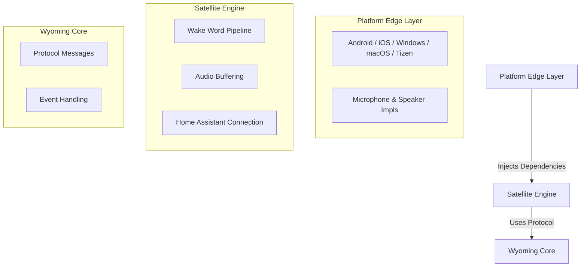

# Wyoming .NET

A cross-platform voice assistant satellite built on the [Wyoming protocol](https://github.com/rhasspy/wyoming), designed to seamlessly integrate with Home Assistant. This project empowers you to transform a wide range of devices into fully functional Wyoming satellites.

---

<div align="center">
  
  
  
  <br>
  
</div>

<br>

<div align="center">
  <a href="docs/assets/tv.mp4">Watch Tizen TV Demo</a>
</div>

---

## 📚 Table of Contents

- [Features](#-features)
- [Supported Platforms](#-supported-platforms)
- [Getting Started](#-getting-started)
  - [Prerequisites](#prerequisites)
  - [Installation](#installation)
  - [Tizen Setup](#tizen-setup)
- [Configuration](#-configuration)
- [Architecture](#-architecture)
  - [Project Structure](#project-structure)
  - [Layered Design](#layered-design)
- [Inference Runtime](#-inference-runtime)
- [Built-in Servers](#-built-in-servers)
- [Roadmap](#-roadmap)
- [Contributing](#-contributing)
- [License](#-license)

---

## ✨ Features

- **Cross-Platform Support**: Runs on Android, iOS, Windows, macOS, Linux, and Tizen (Samsung TVs).
- **Wyoming Protocol**: Fully compliant with the Wyoming protocol for easy Home Assistant integration.
- **Wake Word Detection**: Powered by **OpenWakeWord** for reliable local wake word detection.
- **Text-to-Speech**: Built-in TTS server support with backends like Kokoro.
- **Modern UI**: Clean and intuitive interface built with .NET MAUI (for supported platforms).
- **Modular Architecture**: Designed for extensibility and ease of contribution.

---

## 📱 Supported Platforms

The following platforms are officially supported:

| Platform | Status | Notes |
| :--- | :--- | :--- |
| **Android** | ✅ Supported | Tested on Samsung Galaxy S23+ |
| **iOS** | ✅ Supported | Tested on iPhone 15 Pro, iPad |
| **Windows** | ✅ Supported | Tested on Windows 11 |
| **macOS** | ✅ Supported | Tested on MacBook M4 Pro, Mac Mini M4 |
| **Tizen** | ✅ Supported | Tested on Samsung The Frame TV |
| **Linux** | 🚧 Planned | In development |

---

## 🚀 Getting Started

### Prerequisites

- **.NET 9 SDK** or greater is required to build and run the project.
- For Tizen development, you can use the .NET 9 SDK, but ensure code compatibility with .NET 6 (Tizen 8 runtime).

### Installation

1.  **Clone the repository:**
    ```bash
    git clone https://github.com/yourusername/wyoming-net.git
    cd wyoming-net
    ```

2.  **Build and Run (Desktop/Mobile):**
    Open the solution `Wyoming.Net.sln` in your preferred IDE (Rider, Visual Studio, or VS Code).
    - Select the `Wyoming.Net.Satellite.App.Maui` project.
    - Choose your target framework (e.g., `net9.0-android`, `net9.0-ios`, `net9.0-maccatalyst`, `net9.0-windows10...`).
    - Run the application.

### Tizen Setup

Tizen development has specific requirements. Windows is the recommended development environment for Tizen.

#### Recommended Setup (Windows)

1.  **Install .NET 9 SDK** or greater.
2.  **Install Visual Studio Code**.
3.  **Install the .NET Tizen Workload**:
    ```bash
    workload install tizen
    ```
4.  **Install the VS Code Tizen Extension**.
5.  **Enable Developer Mode** on your Samsung TV.
6.  **Deploy**: Use the Tizen extension in VS Code to build and install the `Wyoming.Net.Satellite.App.Tizen` project to your TV.

> **Note:** Tizen support is currently for Tizen 8 and greater. Tizen 8 runs on .NET 6, but the project is set up to build with the .NET 9 SDK while maintaining .NET 6 compatibility for the Tizen project.

---

## ⚙️ Configuration

The application settings are managed within the app but map to the following internal configuration structures:

- **Mic Settings**: Control volume multiplier, auto-gain, noise suppression, and sample rate.
- **Sound (Snd) Settings**: Configure TTS output, awake/done WAV sounds, and volume.
- **Wake Word**: Enable/disable local wake word detection, set sensitivity (threshold), and refractory periods.

Currently supported Wake Words:
- **Alexa**
- *(More coming soon)*

> **Note:** Automatic model download for wake words is not yet implemented.

---

## 🏗 Architecture

Wyoming.NET follows a clean, layered architecture to ensure separation of concerns and platform independence.

### Project Structure

- **`Wyoming.Net.Core`**  
  The foundation of the system. Contains the implementation of the Wyoming protocol, shared primitives, and event definitions used across all projects.

- **`Wyoming.Net.Satellite`**  
  The "brain" of the satellite. This project contains the core logic for:
  - Audio streaming and buffering.
  - Wake word detection pipeline.
  - Communication with Home Assistant.
  - Audio input/output orchestration.
  
- **`Wyoming.Net.Satellite.App.Maui`**  
  The shared UI layer and application logic for .NET MAUI platforms (Android, iOS, macOS, Windows).

- **`Wyoming.Net.Satellite.App.[Platform]`**  
  Platform-specific entry points (`Droid`, `iOS`, `MacCatalyst`, `Tizen`). These projects handle native bootstrapping and dependency injection of platform-specific services (microphone, speaker).

- **`Wyoming.Net.Tts`**  
  A standalone TTS server implementation compatible with the Wyoming protocol.

### Layered Design



### Dependency Injection
Hardware-specific functionality (Microphone, Speaker) is abstracted via interfaces (`IMicInputProvider`, `ISpeakerProvider`) and injected into the Satellite engine. This allows the core logic to remain platform-agnostic.

---

## 🧠 Inference Runtime

The project leverages different inference engines depending on the platform constraints:

- **ONNX Runtime**: Used on Android, iOS, Windows, Linux, and macOS for efficient local wake word detection.
- **Tizen SingleShot**: Used on Tizen devices (Samsung TVs) as a native alternative to ONNX due to platform limitations.

---

## 🗣 Built-in Servers

### TTS Server
Wyoming.NET includes a built-in TTS server (`Wyoming.Net.Tts`).
- **Backends**:
  - **Kokoro**: High-quality, local text-to-speech.
  - **OpenAI**: High-quality, online text-to-speech.
  - *(More online and offline backends coming soon)*
- **Usage**: Can be run as a standalone service.

To run the TTS server:
```bash
dotnet run --project Wyoming.Net.Tts -- --model kokoro-v0_19 --useCuda false
```

---

## 🗺 Roadmap

### Core Features
- [ ] Silent mode
- [ ] Custom WAV file upload for wake sounds
- [x] UI Improvements
- [x] Multi-TTS model support
- [ ] Multi-Wake Word model support
- [ ] Background execution mode
- [ ] Auto-discovery (Zeroconf)
- [ ] Advanced Audio Processing (Noise Suppression, AEC, VAD)

### Platform Support
- [x] Tizen
- [x] Windows
- [x] macOS
- [ ] Linux
- [x] Android
- [x] iOS

### Performance & Quality
- [ ] `ConfigureAwait(false)` review
- [ ] Memory allocation profiling
- [ ] CPU & Battery optimization

### Distribution
- [ ] Apple App Store
- [ ] Google Play Store
- [ ] Tizen Store

---

## 🤝 Contributing

Contributions are welcome! If you're interested in helping out:
1.  Check the [Roadmap](#-roadmap) for planned features.
2.  Fork the repository.
3.  Create a feature branch.
4.  Submit a Pull Request.

Please ensure your code follows the existing style and architecture patterns.

---

## 📄 License

This project is licensed under the **MIT License**.

---
**Disclaimer**: This project is an independent implementation and is not affiliated with the official Home Assistant or Nabu Casa teams, though it is designed to work seamlessly with their ecosystem.
